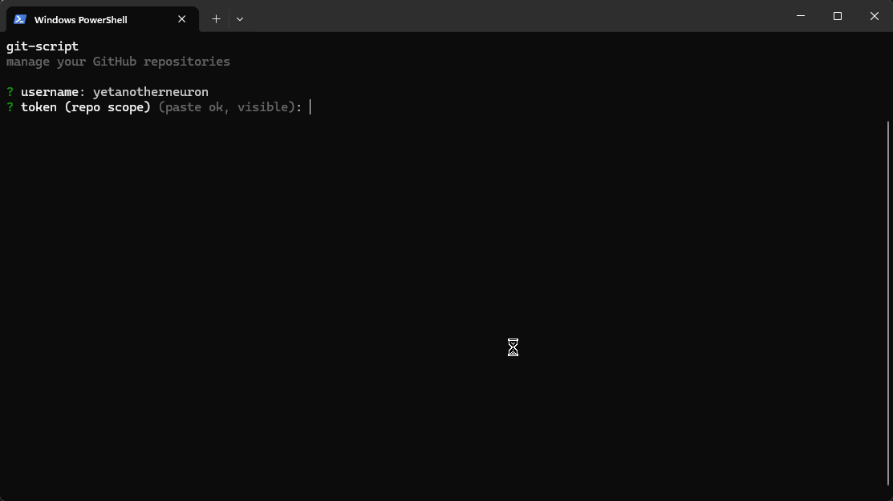
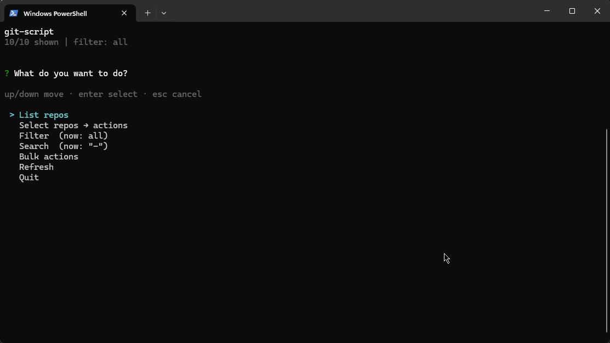
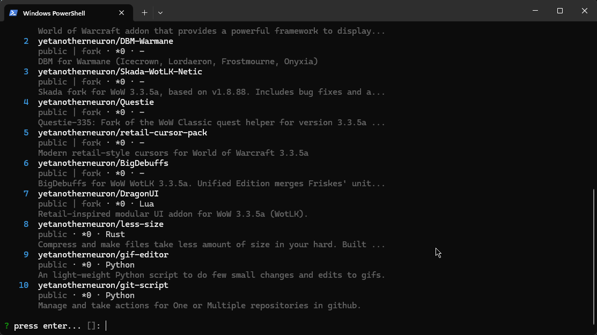
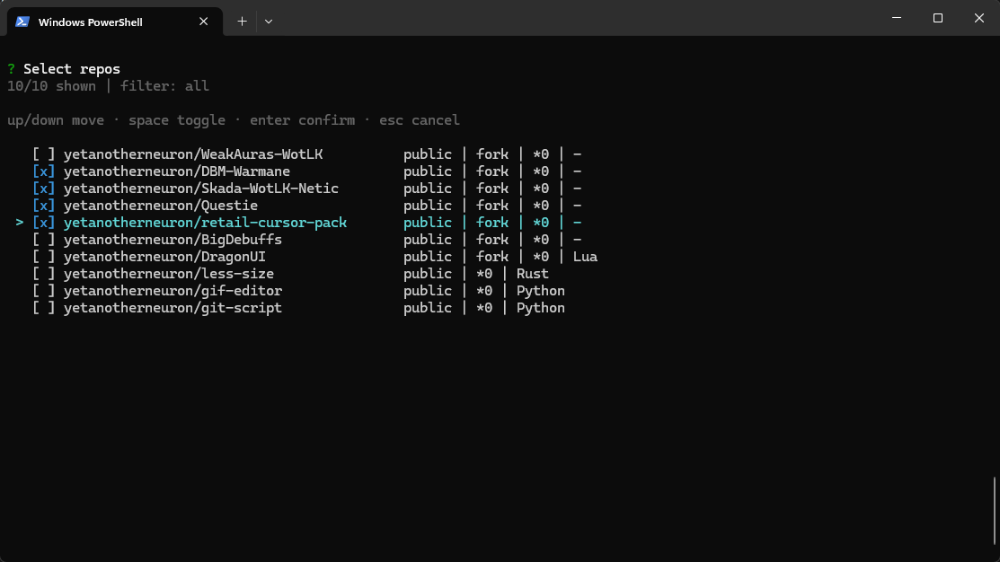
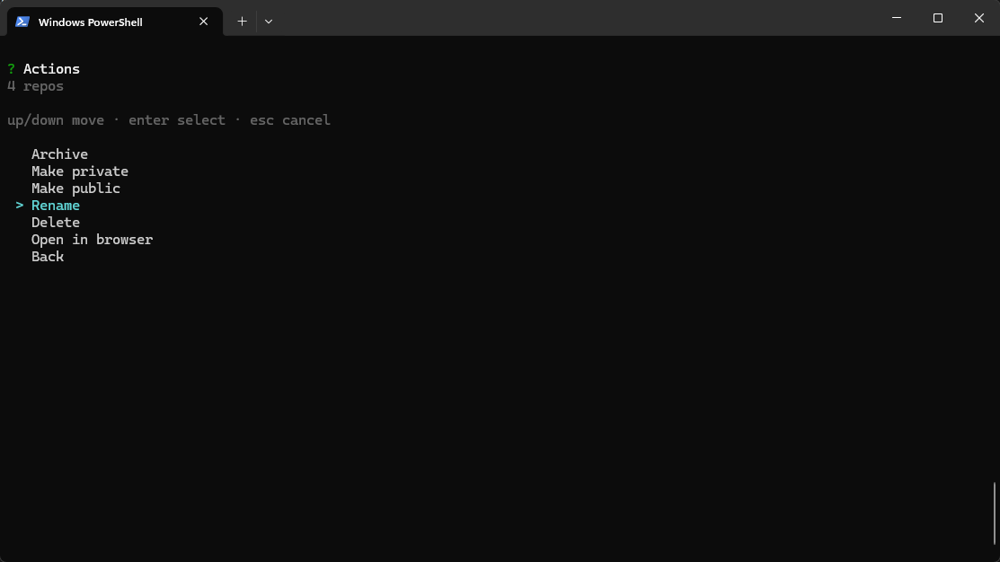

# git-script

Interactive arrow-key terminal menu to manage your GitHub repositories.

## Preview











## Prerequisites

- Python 3.10+
- GitHub token with `repo` scope (`delete_repo` to delete)

## Run

```bash
python main.py
```

| Key | Action |
|-----|--------|
| `up` `down` | move |
| `enter` | select / confirm |
| `space` | toggle multi-select |
| `esc` / `q` | cancel / back |

Paste the token at the prompt (Ctrl+V), or set `GITHUB_TOKEN` / `GH_TOKEN` so it is not typed each run.

## Features

- Login with GitHub username + token
- List, search, and filter repos
- Select one or many repos, then act from a menu
- Archive / unarchive, make private / public, rename, delete, open in browser
- Bulk: all private / all public / remove all forks
- Clear success and error lines

## Menu

- **List repos** — show the current filtered list
- **Select repos → actions** — pick repos, then choose an action
- **Filter** — all / public / private / forks / sources / archived
- **Search** — by name or description
- **Bulk actions** — all private, all public, delete all forks
- **Refresh** — reload from GitHub

## Build exe

Needs [PyInstaller](https://pyinstaller.org/): `pip install pyinstaller`

```bash
python build.py
```

Output is only `dist/GitScript.exe` (no leftover `build/` or `.spec`).

## License

MIT